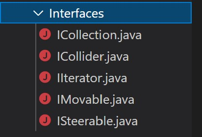

## **Null Pointer Exception Sprint #3**

### **Team Member Name (Individual)** 

Anshul Kumar Shandilya

### **What have I been working on?**

For this week, I refactored the code so that it follows a more understandable structure and also, it makes it easier to implement various design patterns. First of all I have refactored the code structure from all the files being in one folder, to various sub-folders. For example, I have created interfaces such as IMovable and IFixable (relates to)  game objects being movable and fixable. Apart from the above mentioned interfaces, I created other interfaces like  ICollection and IIterator so that it is possible to implement iterator design pattern. My plan to implement the Iterator design pattern relates to the game objects. GameObjects is a class I created which is the base class for all the game objects that the user can see on screen. This class is inherited by sub-classes called movable and fixed. that implement IFixed and IMovable interfaces before. Then depending on whether the game object is movable or not, we can inherit these classes. This makes sure that the code is loosely coupled by design and also the code has some code-reusability in it. Now, coming to the iterator design pattern, in the class GameBoard, the Bricks object is stored as an array of bricks. But I want to make sure that details about the classes are not revealed to the main class. So, I want to implement this using my implementation of Collection and Iterator pattern. As mentioned before, I have already created the interfaces for this. ICollection would act as the aggregate interface and IIteracor would act as an Iterator interface. Then, in Collection folder, I have created a new class called GameCollection.java where I have combined both ConcreteIterator and ConcreteAggregate into one class. The GameCollection class in it's own is mainly a ConcreteAggregate Class that holds the collection. For the ConcreteIterator class, I have created an inner-class within the class GameCollection called ArrayIterator. This acts as the concreteIterator class as described in the Iterator design pattern described in class. 

### **What I plan to do today/this week?**

What I plan to do for this week is to implement the above mentioned Iterator design pattern within the game code. I need to go through with the team for this, as it might mean changing the current implementation and the code that others have implemented so far. When I am done with that, I plan to implement a feature for the game using my implemented Iterator and Collection, to make it possible to support bricks for the game that support variable amount of bricks for the game so that it does not feel repetitive for each level. Also, when mentioning level, the team still needs to implement the levels for the game. 

### **What are my blockers?**

For this sprint, I had no blockers for me.

### **Core XP value - (Communication)**

The communication aspect for this week was maintained well throughout the team. The team constantly updates each other on what things they have completed or worked on using our common chat group which is turning out to be quite effective. Suppose one team has completed one feature, the member will immediately notify the entire team so that they can adjust to the new feature and test it. The team then lets the original developer know if the newly added feature brought any bugs, needs more work, has broken anything else, or is sufficient (basically feedback). This way, the whole team is updated in what the others are doing, and where everyone is at. This might not work for a large company, but it works perfectly for us. 