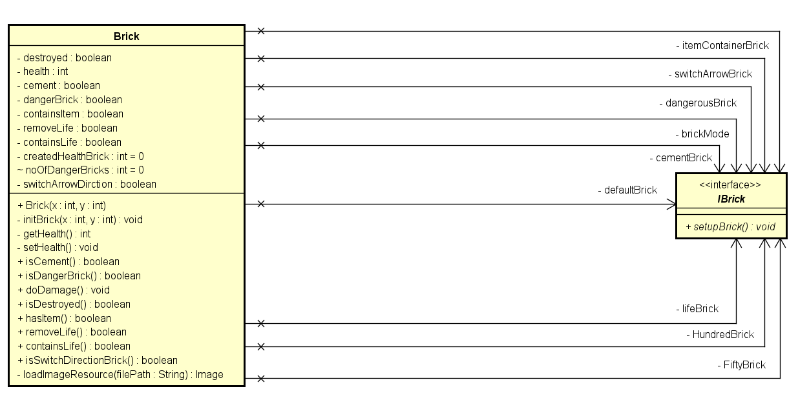
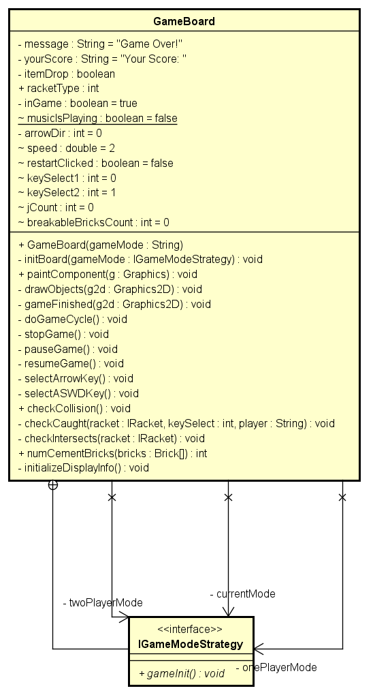
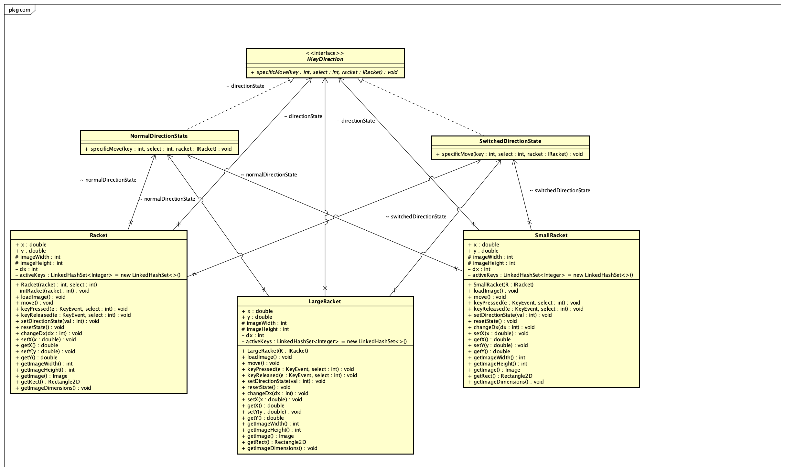
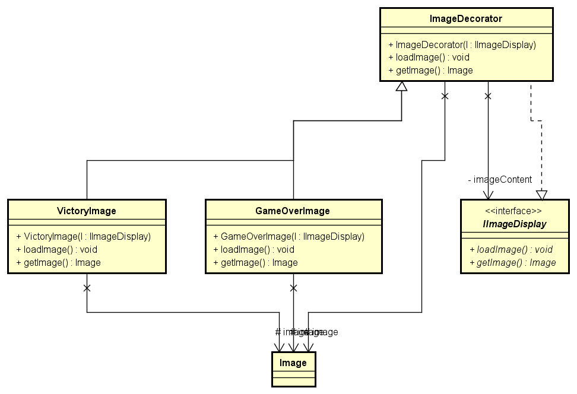
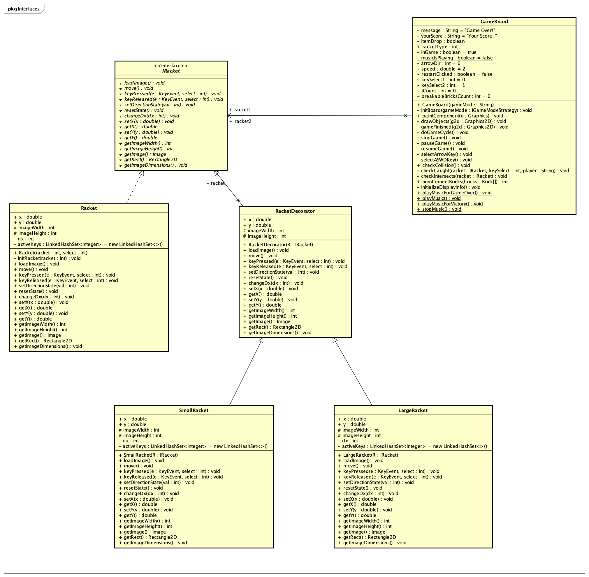
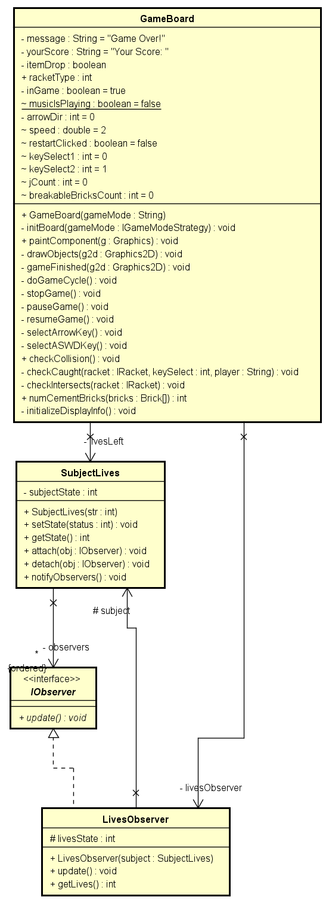
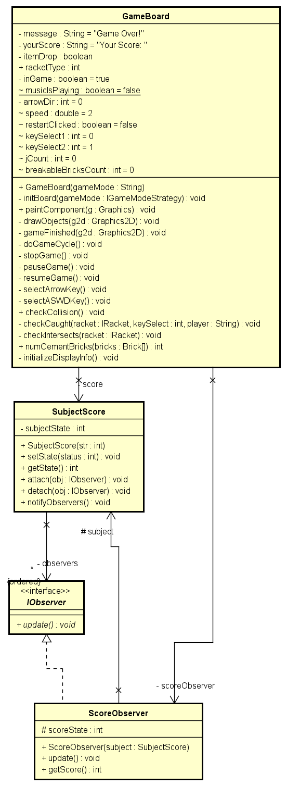
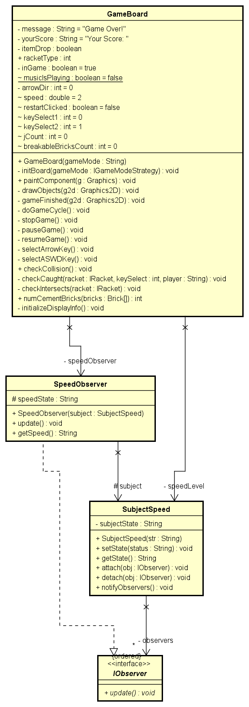

# **Team Project - BrickBreaker (Null Pointer Exception)**

### Game Introduction and Plan

Our team has implemented a brick-breaker game using java. The game will include the traditional bricks, ball, and racket components. The objective of the game is to destroy all the bricks in the window and achieve the highest score possible of 30 points. The player is able to move the paddle from left to right to induce a collision between the ball and paddle to keep the ball in motion and prevent it from falling into the lava. The player is granted three lives to try and complete the game. Since taking part in team activities is fun we also implemented a two player mode which allows players to collaborate in beating the game.

Our plan to implement the game included finding source code, refactoring the code, and implementing features to create a fun and interactive game. Keeping a growth developement mindset, we planned to refactor the code into a system that can be expanded. The source code provided a solid base logic for ball movement, paddle movement, and brick collision, however, the source was very closly coupled and did the system was not implemented in an ideal way for easy and organic growth. The source code also included many gameplay logic errors and gaps which we later addressed and corrected in our own implemenatation. Refactoring included implementing a loosely coupled base, organise various components into packages, and integrate the sourced functions with design patterns.

Once design patterns were implemented and a good code base was complete, the team moved into completing features which enhanced gameplay. These features are highlighted and discussed below along with implementation notes.

### **Link to your team's project Videos**

[Brick Breaker - User Story](https://youtu.be/Q427z0tCDHA)

[Brick Breaker - Demo](https://youtu.be/S3eHdaPgxro)

### **Our Team**
### Name               | Student ID   |  Core XP value
Anshul Kumar Shandilya | 016039894    |  Communication
Boteng Yuan            |              |  Courage
Rafic Hasbini          | 011243466    |  Simplicity
Varun Teja Maguluri    | 016018964    |  Feedback

### **Individual Journals**

* Anshul Kumar Shandilya's Journal - [Week 1](Journals/Anshul/Week1.md), [Week 2](Journals/Anshul/Week2.md), [Week 3](Journals/Anshul/Week3.md), [Week 4](Journals/Anshul/Week4.md)
* Boteng Yuan's Journal - [Week 1](https://github.com/nguyensjsu/sp22-202-null-pointer-exception/blob/main/Journals/Boteng/Week1.md), [Week 2](https://github.com/nguyensjsu/sp22-202-null-pointer-exception/blob/main/Journals/Boteng/Week2.md), [Week 3](https://github.com/nguyensjsu/sp22-202-null-pointer-exception/blob/main/Journals/Boteng/Week3.md), [Week 4](https://github.com/nguyensjsu/sp22-202-null-pointer-exception/blob/main/Journals/Boteng/Week4.md)
* Rafic Hasbini's Journal - [Week1](https://github.com/nguyensjsu/sp22-202-null-pointer-exception/blob/main/Journals/Rafic/Week1.md), [Week 2](https://github.com/nguyensjsu/sp22-202-null-pointer-exception/blob/main/Journals/Rafic/Week2.md), [Week 3](https://github.com/nguyensjsu/sp22-202-null-pointer-exception/blob/main/Journals/Rafic/Week3.md), [Week 4](https://github.com/nguyensjsu/sp22-202-null-pointer-exception/blob/main/Journals/Rafic/Week4.md).
* Varun Teja Maguluri's Journal - [Week 1](https://github.com/nguyensjsu/sp22-202-null-pointer-exception/blob/main/Journals/Varun/Week1.md), [Week 2](https://github.com/nguyensjsu/sp22-202-null-pointer-exception/blob/main/Journals/Varun/Week2.md), [Week 3](https://github.com/nguyensjsu/sp22-202-null-pointer-exception/blob/main/Journals/Varun/Week3.md), [Week 4](https://github.com/nguyensjsu/sp22-202-null-pointer-exception/blob/main/Journals/Varun/Week4.md).

### **Summarizing Brick-Breaker gameplay**

The traditional rules of brick-breaker were conserved allowing for the ball to bounce off the players paddle if a collision between the two occured. Movement of the paddle is possible through player input of the keyboard arrow keys or the AWSD keys. The ball is able to bounce on the side borders and top border of the window, but not the bottom border. If the player fails to collide the ball with the paddle, the ball will fall below the bottom screen and a life will be taken. The ball will then re-initialize and gameplay can continue. 

As bricks are destroyed, each destructable brick is worth one point. Different types of bricks have been implemented to enhance gameplay and making the game more challenging. The bricks implemented include: a non-destructable cement brick, a paddle level-up/level-down brick, a red lose life brick, a green add life brick, and a switch arrow input direction brick for paddle movement.

If a ball collides with a cement brick, the ball will bounce using its normal angled movement. 
If a ball collides with a paddle level-up/level-down brick, an item will be dropped. If the paddle collects the item, then the paddle size will either increase or decrease. 
If the ball collides with the add life brick, the player will gain a life.
If the ball collides with the lose life brick, the player will lose a life.
If the ball collides with the switch paddle input direction brick, the movement key direction will be reversed.

Since the game only consists of a single level, when the game is launched, the bricks are initialized randomly using a numbering system from 1-100. If the number is greater than 95 then a cement brick will be initialized. If the number is in the range 80 - 95 then a full life brick will be initialized.If the number is in the range 50 - 80 then a half life brick will be initialized. If the number is in the range 5 - 20 then a paddle level-up/level-down brick will be initialized. If the number is 4 then a red lose life brick will be initialized. If the number is 2 or 3 then a switch arrow input direction brick will be initialized. If the number is 1 then a green add life brick will be initialized.

Ball movement includes an algorithm to calculate x and y coordinates and switch the direction of the ball after a collision with both the bricks and the paddle. Depending on the direction of ball movement the x or y value is inverted by multiplying the value by -1.

Additional features to enhance the game inlcude adding sound effects including background music, which may be switched on or off, laughing sound effects to tease the player if they lose, and horray sound effects if the game is won. As gameplay advances and more bricks are destroyed, the speed of the ball increases gradually to increase the challenge for the player. 

The player also has the ability to customize background color themes from the main menu, as well as view the top 5 scores achieved.

The player also has the ability to pause and resume the game during gameplay, as well as restart the game at any time using buttons displayed at the top of the screen.

In the home screen menu, the player is also able to select single player or two player modes. For two player mode, the single player game rules and features apply.

### **A High Level Architecture Diagram**

This is the high level architecture class diagram for our game. So, as our game was designed in Java Swing and we have started our project with a started code, initially there were some errors with the code and most of the features that we see in our game were not actually present in the started code. So, we have implemented those such extra features and refactored the code and applied bunch of design patterns to maintain a good standard and stable code. As we can see the class diagram below, we have our interfaces IBrick which handles the brick capabilities, ICollider which tracks the collision between ball and brick, ball and paddle. IImageDisplay which handles the display images, IIterator which handles the iteration mechanism, IKeyDirection which handles the keys direction which the player uses them to move the paddle left or right from the keyboard. IMovable interface which handles the movement of the paddle. IObserver which handles the different observers that we have described in our project. IRacket which handles the paddle mechanism. ISteerable interface which handles the keysPressed and keysReleased by the player during the game. ISubject interface which handles the attach, detach and notifying observers for different observer patterns we have implemented in our game. Finally we have AudioStrategy interface which handles the audio inputs for our game.

Also in the class diagram, we can see different objects included in our game as in Ball, Brick, Racket, GameOverImage, VictoryImage. So, these are all the different UI objects that were created in our game to handle different features which were related to each object. And here, we have a Sprite class which handles the diections of ball, its geometry calculation aqnd its position for each and every frame and the sizes and lengths and widths of each UI components. We have Item class which extends Sprite class. The functionality of this Item class is to load the UI components, get the image dimensions of all of the compnents and get the directions of each UI component. Then we have different classes which handles different major parts of the game. AudioChanger class which handles the different audio outputs based on the player's performance. BrickBreaker class which initializes the UI for our game and it is our main class. We have DogMusic class which has the content to play the music when the user lose his game. Similarly VictoryMusic class which has the content to play the music when the user wins the game.

GameBoard class which has the different methods to draw2D objects on the game console, and gameFinished() which will execute if the player loses his game and we have stopGame() to stop the current game and we have pauseGame() and resumeGame() methods to pause or resume the game according to player's choice. Then we have check collision method to check the collision status between the ball and bricks and between ball and paddle. We have HighScoreBoard class which will keep track of high scores of each player and each game. And we have MenuScreen class which extends JPanel and it has methods OnePlayerHandler and TwoPlayerHandler which handles the one player mode and two player mode. And also we have NormalDirectionState class which will reset the paddle direction to normal. But we have another class called SwitchedDirectionState class which will reverse the direction of paddle apart from the keys pressed in the keyboard. That is if the player hits right arrow, the paddle will move to left. Similarly, if the user hits the left arrow, the paddle will move to right. We have ThemeMenu class which will initialize the background color change for the game background. Then finally we have StopMusic class which will be closing any music and flushing the file stored. So, this is the overall explanation of our high level architecture of our class diagram.

#### Strategy pattern for switching music:

To change the different background music for the game based on the player's performance, the strategy pattern was implemented. It will be easy to switch the audio in runtime using strategy pattern. The AudioStrategy is the interface for this pattern. AudioChanger is the class which is having the changeStrategy() and setAudioOutput() methods to perform the change for different strategies for different scenarios. The four classes which implements AudioStrategy interface are DogMusic, VictoryMusic, GameMusic and StopMusic. So, by default, the strategy is set to GameMusic because whenever the game starts, this will the music that should be played. Then when the player tries to hit the bricks with ball and succeeds the task and wins, then the strategy is set to StopMusic which will stop all audio inputs and then sets the strategy to VictoryMusic. Similarly, if the player loses all his lives and loses the game, then the strategy is set to StopMusic and then it is set to DogMusic. And finally , when the uses restarts the game, then the strategy is set to GameMusic again.

#### Strategy pattern for different Bricks:

The strategy pattern is implemented for showing the different bricks in the game. As the bricks will be generated randomly for each game, the strategy pattern excatly fits for this scenario. Here IBrick is the interface and Brick class is the base class which handles all the brick features. Here, we have different brick styles like cement brick, green brick, red brick, blue brick, multi-colored brick and normal brick. So, for each and every brick, there is one purpose. So, each brick will have its feature to implement bases on the color. So, it will be easy to change the strategies in runtime based on the color fo the brick. And we also have different methods in our Brick class like initBrick(x,y), getHealth(), setHealth(), isCement(), isDangerBrick(), doDamage(), isDestroyed(), hasItem(),removeLife(), containsLife() and isSwitchDirectionBrick(). These methods will have their features to implement based on the players performance.

#### Strategy pattern for different game mode:

IGameModeStrategy is an interface for implementing two players mode. The game will be initialized based on what mode the player selected. One player mode strategy and two players strategy are implemented in GameBoard.java using lambda functions becasue there are only one method called gameInit in this object. The differences between two strategies are the number of rackets that was created, the functionalities of buttons at top, and also the keys that used for moving the rackets. Also, I used a variable called currentMode to memorize what the current game mode is becasue the game logic may vary based on the game mode.

#### State machine pattern for change racket move direction:

To switch user input direction for the paddle, a state machine was implemented. The initialized racket class includes a parameter to identify the direction state (either normal or switched). The parameter will alternate between the two states if the switch input direction brick is destroyed. The two state classes SwicthedDirectionState and NormalDirectionState implement the move method in the interface class IKeyDirection. The specific state move method is then called based on the current state in the initialized racket.

#### Decorator pattern for game ending images:

The decoratod pattern is implemented for changing the background images inside the game based on the players performance in the game. In here IImageDisplay is the interface and ImageDecorator is the decorator class which handles the remaining part. Here, basically we have two classes, GameOverImage and VictoryImage which extends the ImageDecorator class. So, basically we have two methods in it. loadImage() and getImage(). So, each and every time if the player wins the game, then the image intended to show victory sign is loaded and then displayed on the game console. Similarly if the user loses the game, the image sign for losing the game will be loaded using loadImage() and then displayed on the game console.

#### Decorator pattern for different racket types:

A decorator design pattern has been implemented for the racket. An interface class for racket, IRacket, defines the methods to be used in the racket implementation. The base Racket class implements the all methods from the interface. An abstract decorator class RacketDecorator also implements the methods in IRacket. Finally all the different rackets with additional features extend the RacketDecorator class as concrete decorators. This implementation allows for even more features to be implemented for the racket with ease. For the current two racket decorators implemented, since the size of the racket changes, these interfered with the base object variables and needed re-implementation of many methods. However in the case where the racket size stays the same as the original and only additional behavior is implemented, this re-implementation is not needed.

#### Observer pattern for lives:

Observer pattern is implemented for handling the number of lives of a player in each game. So, we have our interface IObserver and also two classes LivesObserver and SubjectLives. The LivesObserver will be implementing the IObserver interface. The LivesObserver class will be having the variable LivesState which handles the count of number of lives at present. And we have getLives() and update() methods which handles getting the number of lives and updates the lives to increment or decrement based on the player's game. In SubjectLives class, we have SubjectState variable which keeps track of lives. And also we have setState() to set the current state of the life and getState() to get the current life status. We have attach() method to attach the observer and in the same way detatch() metho to detach the observer and finally notifyObservers() to notify the observers regarding its status.

#### Observer pattern for score:

Observer pattern is implemented to keep track of the score for each player. So, basically we have IObserver as interface and ScoreObserver class as our base class to handle the score mechanism. Here, we have scoreState variable which will handle the current score status. And we have update() which will update the player's score based on the bricks that he hits as for every brick there will be different scenario of adding score. I mean if the user hits the cement brick, no score will be incremented for the player. And we have getScore() which will be handling the score content and keeps track of score for each time incremented. We have SubjectScore class which will be having a variable SubjectState which handles the count of scores.  And also we have setState() to set the current state of the score and getState() to get the current score status. We have attach() method to attach the observer and in the same way detatch() metho to detach the observer and finally notifyObservers() to notify the observers regarding its status. 

#### Observer pattern for speed:

For handling the different levels of speed for the ball, we have implemented the observer pattern for it. As we were maintaining 3 levels of speed for the game and will be changed based on the player's score. We have IObserver as interface and SpeedObserver which implements the IObserver interface. Here, we have SpeedState variable which keeos track of speed of the ball everytime it hits the bricks. So, we have update() which will update the ball speed based on the score of the player in the game. And we have getSpeed() whcih will get the current speed level of the ball in current scenario. We have SubjectSpeed class which will be having a variable SubjectState which handles the speed level of ball.  And also we have setState() to set the current state of the speed and getState() to get the current speed status. We have attach() method to attach the observer and in the same way detatch() metho to detach the observer and finally notifyObservers() to notify the observers regarding its status. 

### **Burndown Chart**

### **UI Wireframes**

### **Game Screenshots**

### **Main Screen**

### **Game Screen**

### **Game Over Screen**

### **Victory Screen**

### **Two Player Mode Screen**

### **A summary of the key features (include any special design ideas implemented)**

Change racket size bricks: When the blue bricks are broken, they will drop an item. If the item is picked up, then the racket will change size:
 
  - Long Racket
  - Short Racket
 
Rainbow brick : Switch arrow direction brick.
 
  - changes the direction of arrows once this brick is destroyed
 
Green brick: Additional life brick.
 
  - By destorying this brick: the player is awarded an additional life/chance.
 
Red brick: removes a life.
 
  - By destroying this brick the player loses a life
  - If player is on their last life, they lose the game.
 
Two player mode:
 
  - Allow for two players to play together to beat the game on the same team.
  - Two rackets are present in two player mode.
 
Blue Brick : Special Brick
 
  - Drops a special ball, which may increase or decrease the racket size.
  
 Background Sounds :
  
  - Audio implementation for both winning and losing game.

### **Final Analysis**
This project was fun to implement and really nurtured our abilities to design a good software system and follow agile/scrum methodologies. While we are happy with the final product, there is always room for expaning with more features and correcting some minor bugs. One bug which may be corrected is the angle of reflection from the paddle once the ball collides with it. At certain points on the paddle, the angle is not correct. Also, additional features to enhance the game may include a racket with a gun to shoot bricks. 
