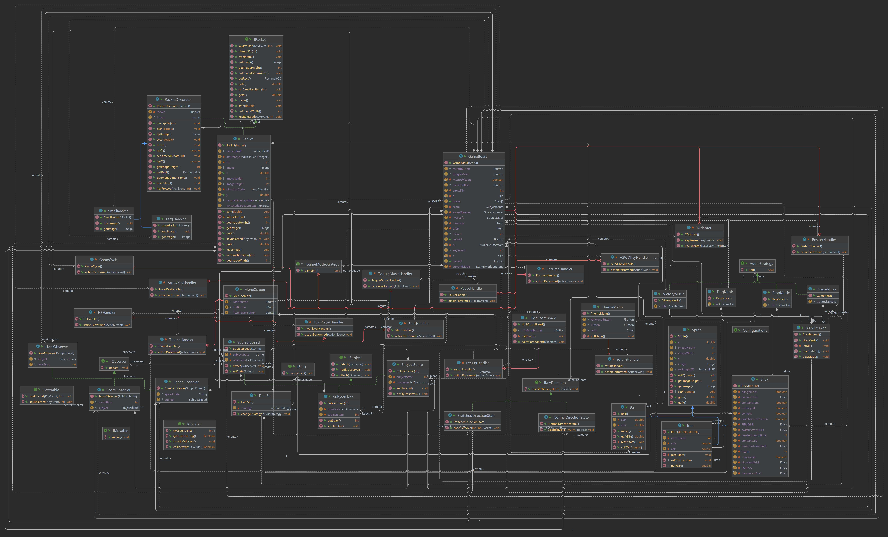

# **Team Project - BrickBreaker (Null Pointer Exception)**

### Game Introduction and Plan
We are implementing a  simple brick breaker game which will be having layers of bricks and ball with which to break the layers. The player moves the paddle from left to right to keep the ball from falling. A life is used when the player fails to hit the ball with paddle. The paddle doesn’t bounce the ball like a mirror, although it does so when the ball hits right in the middle. The closer the bounce take place to the left end of the paddle, a more significant left turn is added to an expected mirror bouncing.

A regular brick disappears when it’s hit by the ball, or breaks a little if it’s a bulkier brick. At the same time, for every brick hit, there will be increase in the score. And by default the player will be given 3 lives. If the user finishes off these 3 lives, then the game will be over. In addition to that, there will be some special bricks in the game. If the player hits those bricks, a new ball will be added into game. When the user hits this new ball with paddle, the paddle size increases. We are also planning to implement background music for our brick breaker game.

### **Link to your team's project Videos**

--- Link to video here ---

### **Our Team**
* Anshul Kumar Shandilya
* Boteng Yuan
* Rafic Hasbini
* Varun Teja Maguluri

### **Individual Journals**

* Anshul Kumar Shandilya's Journal - [Week 1](Journals/Anshul/Week1.md), [Week 2](Journals/Anshul/Week2.md), [Week 3](Journals/Anshul/Week3.md), [Week 4](Journals/Anshul/Week4.md)
* Boteng Yuan's Journal - [Week 1](https://github.com/nguyensjsu/sp22-202-null-pointer-exception/blob/main/Journals/Boteng/Week1.md), [Week 2](https://github.com/nguyensjsu/sp22-202-null-pointer-exception/blob/main/Journals/Boteng/Week2.md), [Week 3](https://github.com/nguyensjsu/sp22-202-null-pointer-exception/blob/main/Journals/Boteng/Week3.md)
* Rafic Hasbini's Journal - [Week1](https://github.com/nguyensjsu/sp22-202-null-pointer-exception/blob/main/Journals/Rafic/Week1.md), [Week 2](https://github.com/nguyensjsu/sp22-202-null-pointer-exception/blob/main/Journals/Rafic/Week2.md), [Week 3](https://github.com/nguyensjsu/sp22-202-null-pointer-exception/blob/main/Journals/Rafic/Week3.md), [Week 4](https://github.com/nguyensjsu/sp22-202-null-pointer-exception/blob/main/Journals/Rafic/Week4.md).
* Varun Teja Maguluri's Journal - [Week 1](https://github.com/nguyensjsu/sp22-202-null-pointer-exception/blob/main/Journals/Varun/Week1.md), [Week 2](https://github.com/nguyensjsu/sp22-202-null-pointer-exception/blob/main/Journals/Varun/Week2.md), [Week 3](https://github.com/nguyensjsu/sp22-202-null-pointer-exception/blob/main/Journals/Varun/Week3.md)

### **Summarizing our game**
The game that we as a team developing is Brick Breaker. So, the main concept of this game is, the player will be given a ball and all the time the ball will be in motion. And the player will just be controlling the paddle at the bottom which he can just move that paddle left and right. The main task of the player is to hit the ball with paddle and also make sure the ball hits the bricks at top. If he fails to hit any brick or fails to hit the ball with his paddle, then one life of the player will be lost. By default, each player will be given 3 lives. So, in this game, there were extended features like special bricks whose functionality is whenever the user hits this special brick, a new ball will be added to the game and if he managed to hit that ball, his paddle length will be increased. And also another extra feature that is planned to implement in this game is background music for this game.

### **A High Level Architecture Diagram**

### **A summary of the key features (include any special design ideas implemented)**

Change racket size bricks: When the blue bricks are broken, they will drop an item. If the item is picked up, then the racket will change size: 
 
  - Long Racket
  - Short Racket
 
Rainbow brick : Switch arrow direction brick. 
 
  - changes the direction of arrows once this brick is destroyed
 
Green brick: Additional life brick.
 
  - By destorying this brick: the player is awarded an additional life/chance.
 
Red brick: removes a life.
 
  - By destroying this brick the player loses a life
  - If player is on their last life, they lose the game.
 
Two player mode:
 
  - Allow for two players to play together to beat the game on the same team.
  - Two rackets are present in two player mode.

 
