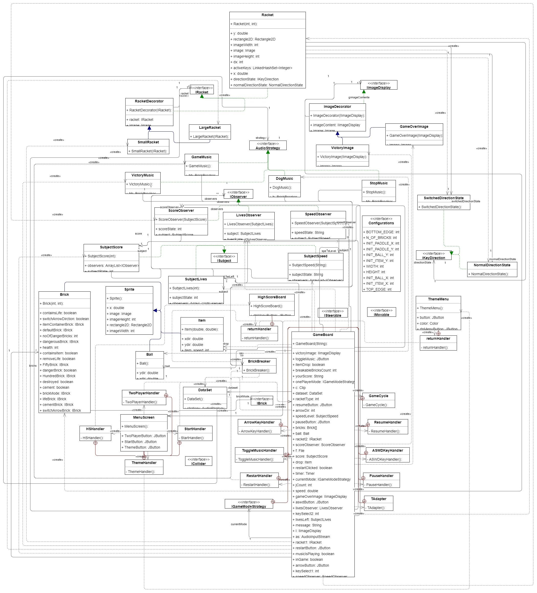

# **Team Project - BrickBreaker (Null Pointer Exception)**

### Game Introduction and Plan
We are implementing a  simple brick breaker game which will be having layers of bricks and ball with which to break the layers. The player moves the paddle from left to right to keep the ball from falling. A life is used when the player fails to hit the ball with paddle. The paddle doesn’t bounce the ball like a mirror, although it does so when the ball hits right in the middle. The closer the bounce take place to the left end of the paddle, a more significant left turn is added to an expected mirror bouncing.

A regular brick disappears when it’s hit by the ball, or breaks a little if it’s a bulkier brick. At the same time, for every brick hit, there will be increase in the score. And by default the player will be given 3 lives. If the user finishes off these 3 lives, then the game will be over. In addition to that, there will be some special bricks in the game. If the player hits those bricks, a new ball will be added into game. When the user hits this new ball with paddle, the paddle size increases. We are also planning to implement background music for our brick breaker game.

### **Link to your team's project Videos**

[User Story - Brick Breaker](https://youtu.be/Q427z0tCDHA)

[Brick Breaker - Demo](https://youtu.be/S3eHdaPgxro)

### **Our Team**
* Anshul Kumar Shandilya
* Boteng Yuan
* Rafic Hasbini
* Varun Teja Maguluri

### **Individual Journals**

* Anshul Kumar Shandilya's Journal - [Week 1](Journals/Anshul/Week1.md), [Week 2](Journals/Anshul/Week2.md), [Week 3](Journals/Anshul/Week3.md), [Week 4](Journals/Anshul/Week4.md)
* Boteng Yuan's Journal - [Week 1](https://github.com/nguyensjsu/sp22-202-null-pointer-exception/blob/main/Journals/Boteng/Week1.md), [Week 2](https://github.com/nguyensjsu/sp22-202-null-pointer-exception/blob/main/Journals/Boteng/Week2.md), [Week 3](https://github.com/nguyensjsu/sp22-202-null-pointer-exception/blob/main/Journals/Boteng/Week3.md), [Week 4](https://github.com/nguyensjsu/sp22-202-null-pointer-exception/blob/main/Journals/Boteng/Week4.md)
* Rafic Hasbini's Journal - [Week1](https://github.com/nguyensjsu/sp22-202-null-pointer-exception/blob/main/Journals/Rafic/Week1.md), [Week 2](https://github.com/nguyensjsu/sp22-202-null-pointer-exception/blob/main/Journals/Rafic/Week2.md), [Week 3](https://github.com/nguyensjsu/sp22-202-null-pointer-exception/blob/main/Journals/Rafic/Week3.md), [Week 4](https://github.com/nguyensjsu/sp22-202-null-pointer-exception/blob/main/Journals/Rafic/Week4.md).
* Varun Teja Maguluri's Journal - [Week 1](https://github.com/nguyensjsu/sp22-202-null-pointer-exception/blob/main/Journals/Varun/Week1.md), [Week 2](https://github.com/nguyensjsu/sp22-202-null-pointer-exception/blob/main/Journals/Varun/Week2.md), [Week 3](https://github.com/nguyensjsu/sp22-202-null-pointer-exception/blob/main/Journals/Varun/Week3.md), [Week 4](https://github.com/nguyensjsu/sp22-202-null-pointer-exception/blob/main/Journals/Varun/Week4.md).

### **Summarizing our game**
The game that we as a team developing is Brick Breaker. So, the main concept of this game is, the player will be given a ball and all the time the ball will be in motion. And the player will just be controlling the paddle at the bottom which he can just move that paddle left and right. The main task of the player is to hit the ball with paddle and also make sure the ball hits the bricks at top. If he fails to hit any brick or fails to hit the ball with his paddle, then one life of the player will be lost. By default, each player will be given 3 lives. So, in this game, there were extended features like special bricks whose functionality is whenever the user hits this special brick, a new ball will be added to the game and if he managed to hit that ball, his paddle length will be increased. And also another extra feature that is planned to implement in this game is background music for this game.

### **A High Level Architecture Diagram**



#### Strategy pattern for switching music:


#### Strategy pattern for different Bricks:

For implementing various types of bricks that exist in the game, different attributes of the brick class had to be instantiated. For each of the bricks, let's say cement brick, health brick, had to be setup diferently than each other. For example, the regular health brick has health 50 and is descrictible, whereas for comparision, the cement brick is configured differently, as it's health attribute should not be initialized as it is supposed to be indestructible. So, here arises the need to configure different bricks, using different strategies. 
For initializing the bricks, Strategy pattern was used (diagram provided below). For the strategy pattern, The IBrick interface was created, which provides the abstract method called ```setupBrick()```, to initialize the bricks. The Brick class then acts as a concrete strategy as various lambda implementations for the different bricks are provided. The implementations are provided in the brick class as: (for each type of brick)
```
    private final IBrick <brick_type> = () -> {
        //Config brick
        //...
        //...
    };
```
The brick class also acts as the context. Upon initialization of a brick object, the ```initBrick(...)``` function is called which then choses what type of brick the current object sha;l be. Based on generated random number, the ```initBrick()``` function decides the type of the brick for the object, and then configures the brick strategy called ```brickMode``` using whatever strategy it chose via the RNG. 


#### Strategy pattern for different game mode:

IGameModeStrategy is an interface for implementing two players mode. The game will be initialized based on what mode the player selected. One player mode strategy and two players strategy are implemented in GameBoard.java using lambda functions becasue there are only one method called gameInit in this object. The differences between two strategies are the number of rackets that was created, the functionalities of buttons at top, and also the keys that used for moving the rackets. Also, I used a variable called currentMode to memorize what the current game mode is becasue the game logic may vary based on the game mode.


#### State machine pattern for change racket move direction:


#### Decorator pattern for game ending images:


#### Decorator pattern for different racket types:


#### Observer pattern for lives, score and speed:

For the score, speed and lives part of the game, Observer pattern was implemented. The score, life and speed of the gameplay is important for the user to know, as it improves the gameplay by giving the user some information about the game state. However this information can also be used somewhere else in the game, for example, updating the score board using score, using current lives left for the player to determine how the game progresses (0 lives means game over) and speed variable for the game to increase the speed of the ball in action. All of this is done in different classes, and it would prove to be a security threat to change the visibility of these attributes to public for access across the codebase. Also, it would prove to be a challenge to maintain the same variable state once changed by any entity in the code. So observer pattern was implemented to solve these issues. 
All three attributes for the game lives, score and speed were made to be subjects separately. They all implement the interface ```ISubject.java``` which provides abstract methods for attach, detach and notify. For this, new classes were created, which act as concrete subject. They are SubjectLives, SubjectScore and SubjectSpeed. Then the observers were created. The observers implement an interface ```IObserver.java``` that provides the abstract method for updating the observer. The lives, score and speed are always changed using their respective subject class , ie SubjectLives, SubjectScore and SubjectSpeed. This ensures that wherever the observer lies in the code, it will be updated of the change of state in the above attributes. This includes on the score board, on the GUI information to the user and so on. **The UML diagrams for each observer pattern is provided below.**

##### Lives, score and speed Observer:


### **Burndown Chart**


### **UI Wireframes**


### **A summary of the key features (include any special design ideas implemented)**

Change racket size bricks: When the blue bricks are broken, they will drop an item. If the item is picked up, then the racket will change size:
<br>
  - Long Racket
  - Short Racket
<br>
Rainbow brick : Switch arrow direction brick.
<br>
  - changes the direction of arrows once this brick is destroyed
<br>
Green brick: Additional life brick.
<br>
  - By destorying this brick: the player is awarded an additional life/chance.
<br>
Red brick: removes a life.
<br>
  - By destroying this brick the player loses a life
  - If player is on their last life, they lose the game.
<br>
Two player mode:
<br>
  - Allow for two players to play together to beat the game on the same team.
  - Two rackets are present in two player mode.
<br>
Blue Brick : Special Brick
<br>
  - Drops a special ball, which may increase or decrease the racket size.
 <br>
 Background Sounds :
 <br>
  - Audio implementation for both winning and losing game.
